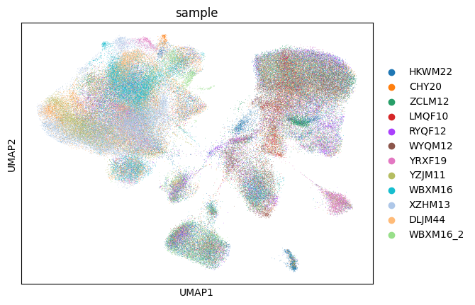
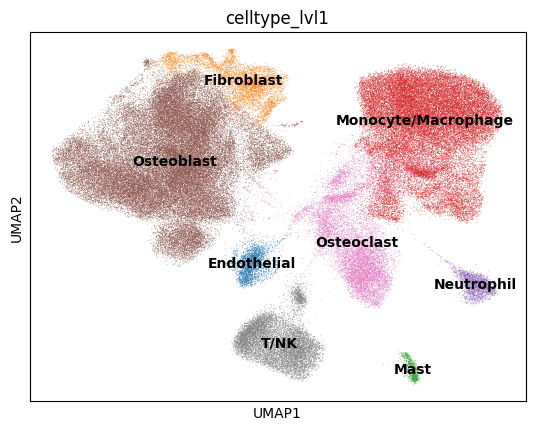
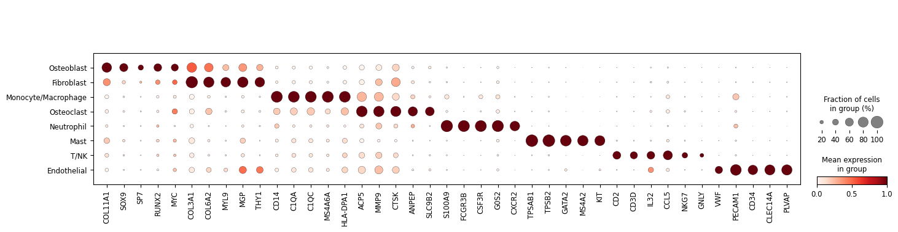
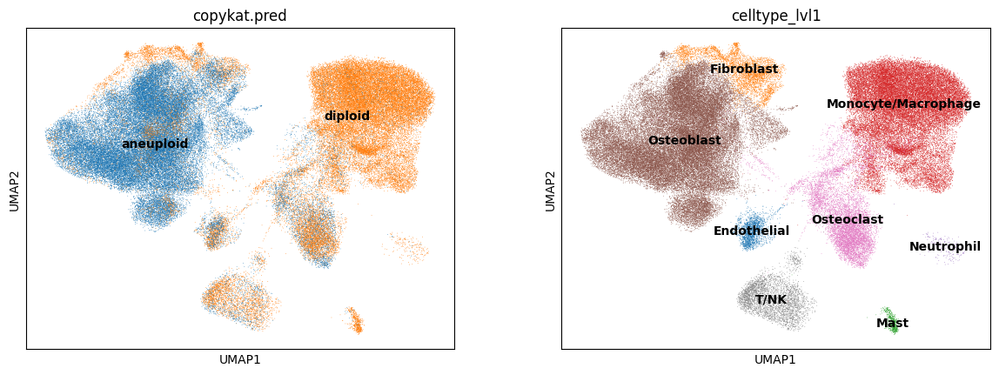
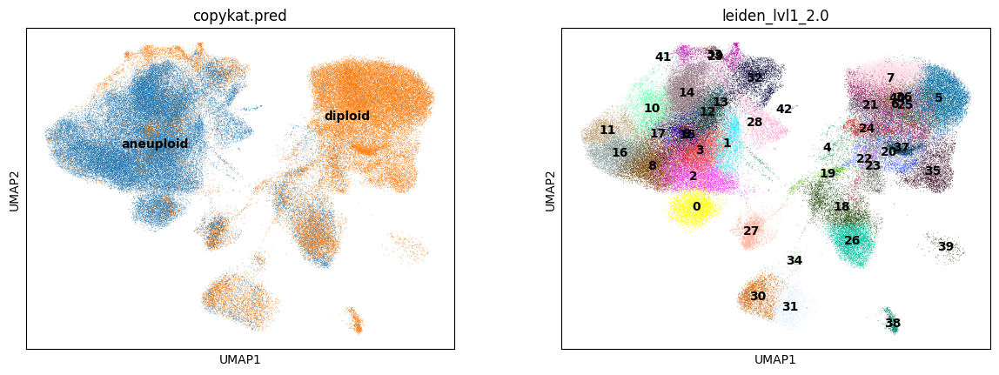
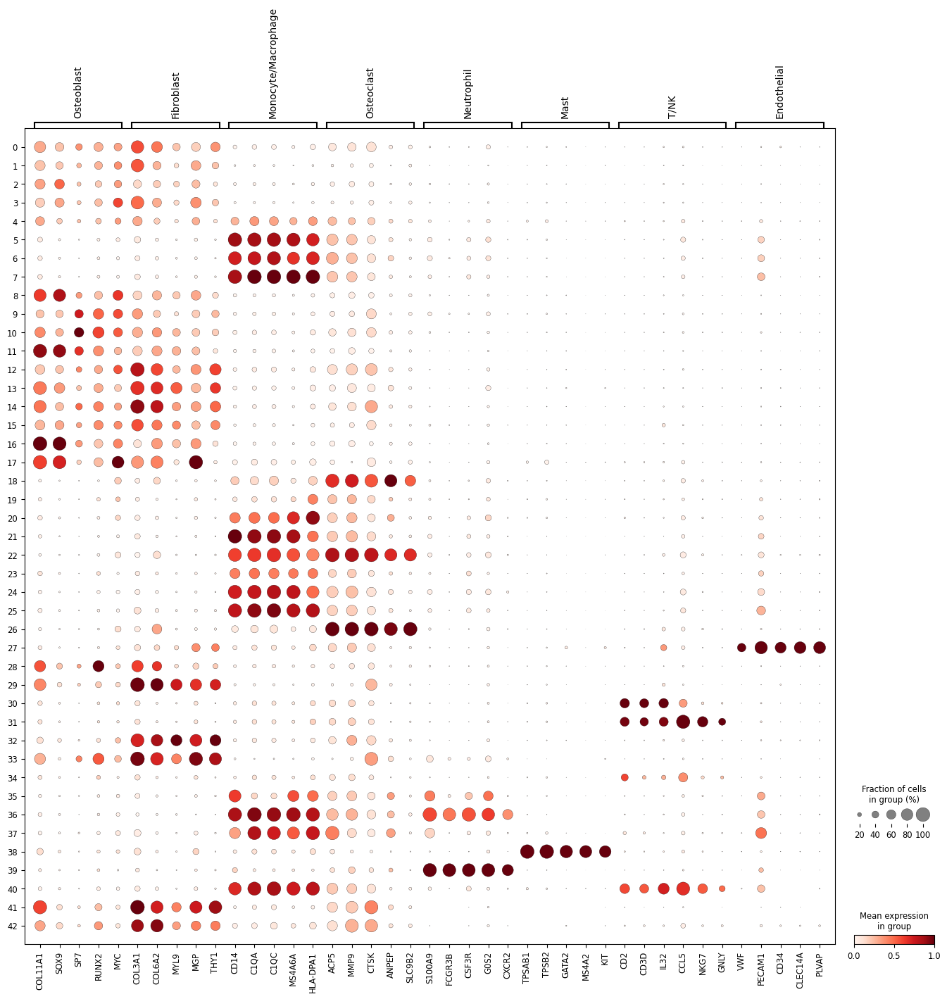
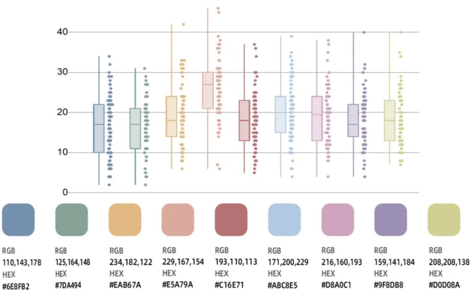

## Methods

### Environment

```shell
# create python environment
conda create -n sc python=3.12 -y
conda activate sc
pip install 'scanpy[leiden]'
pip install scrublet harmonypy notebook
```

```shell
# create R environment
conda create -n r433 python=3.10 -y
conda activate r433
conda install conda-forge::r-base=4.3.3 -y
conda install conda-forge::r-seurat -y
conda install conda-forge::r-devtools -y
R
> devtools::install_github("navinlabcode/copykat")
```

### Run

```shell
# run line by line
conda activate sc
python 00_create_adata.py
python 01_qc.py
python 02_concatenate.py
python 03_harmony.py
jupyter execute 04_annotate_lvl1.ipynb --inplace
python 05a_prepare_data.py
conda activate r433 && Rscript 05b_copykat.R && conda deactivate
```

## Results

### Quality control

**QC Strategy:**

1. Cells with < 500 genes were excluded.
2. Genes expressed in < 0 cells were exclude (not filtering genes before merging).
3. Percentage of counts in mitochondrial genes was calculated in each cell.
4. Doublet scores were calculated using Scrublet.
5. Leiden clustering was done.
6. Cells with percentage of counts in mitochondrial genes greater than 2
   standard deviations from the mean percentage of counts in mitochondrial
   genes of their leiden clusters were removed.
7. The predicted doublets were removed.
8. Leiden clusters with mean doublet score greater than 2 standard deviations
   from the mean doublet score of all cells the were excluded.

**After concatenation,** genes with ≥ 10 UMI in at least 10 cells were included for downstream analysis.

**Finally,** 128637 cells and 32982 genes passed QC.

### Integration

1. Harmony was good.
   
2. Batch effect was removed using Harmony while some clusters (14) were predominently found in one sample. [TODO: exclude?]

### Annotation

Cell type annotation using Leiden.

```python
# markers
marker_genes = {
    'Osteoblast': ['COL11A1', 'SOX9', 'SP7', 'RUNX2', 'MYC'],
    'Fibroblast': ['COL3A1', 'COL6A2', 'MYL9', 'MGP', 'THY1'],
    'Monocyte/Macrophage': ['CD14', 'C1QA', 'C1QC', 'MS4A6A', 'HLA-DPA1'],
    'Osteoclast': ['ACP5', 'MMP9', 'CTSK', 'ANPEP', 'SLC9B2'],
    'Neutrophil': ['S100A9', 'FCGR3B', 'CSF3R', 'G0S2', 'CXCR2'],
    'Mast': ['TPSAB1', 'TPSB2', 'GATA2', 'MS4A2', 'KIT'],
    'T/NK': ['CD2', 'CD3D', 'IL32', 'CCL5', 'NKG7', 'GNLY'],
    'Endothelial': ['VWF', 'PECAM1', 'CD34', 'CLEC14A', 'PLVAP'],
}
```




### Copykat

"low confidence in classification" and "WARNING! NOT CONVERGENT!" in DLJM44, WBXM16, WBXM16_2, WYQM12, XZHM13

1. Fibroblast and Osteoblast didn't match the copykat prediction perfectly.
   
   Although adding resolution in leiden clustering recognized cluster 32 in `leiden_lvl1_2.0`, gene expression of cluster 32 represented fibroblast type.
   
   
   As a result, we still considered cluster 32 as fibroblast.
2. Osteoclast also showed copy number alternation, probably due to the cell fusion.
3. [TODO: CNV]

## Writing


### Colors


