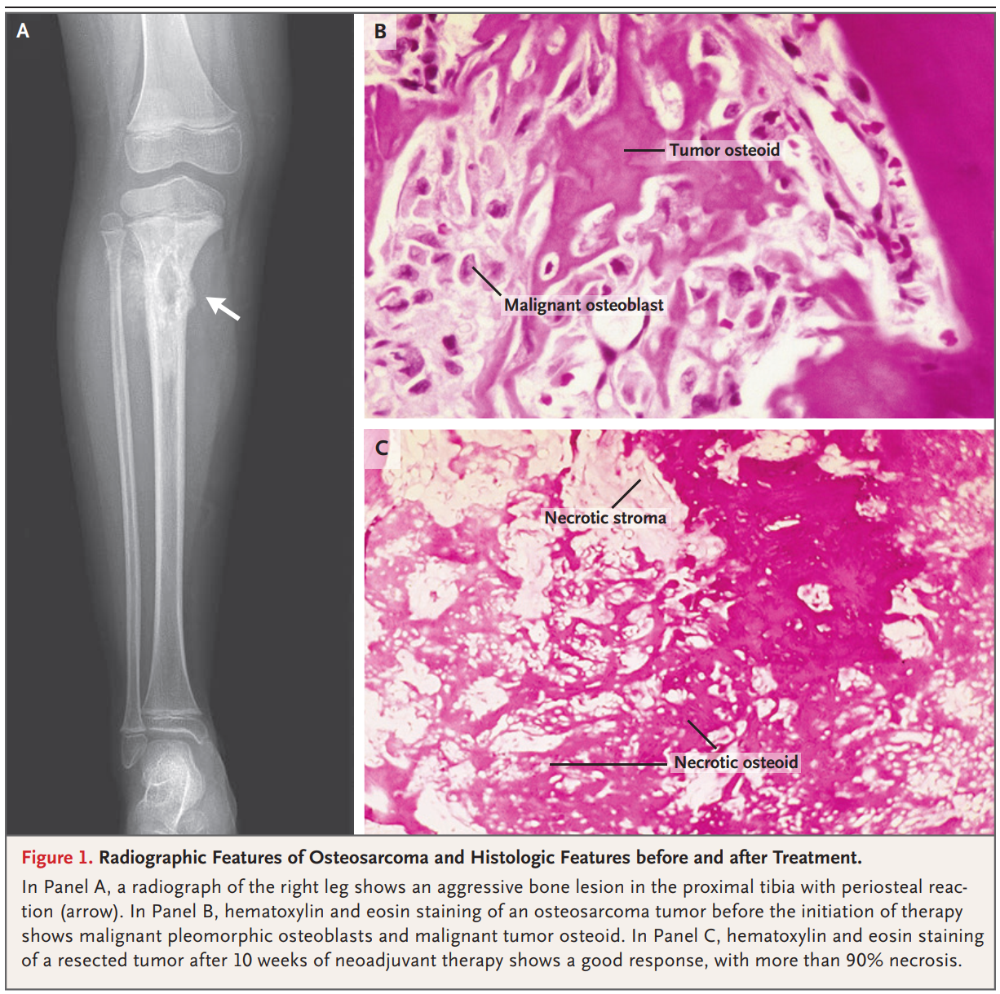
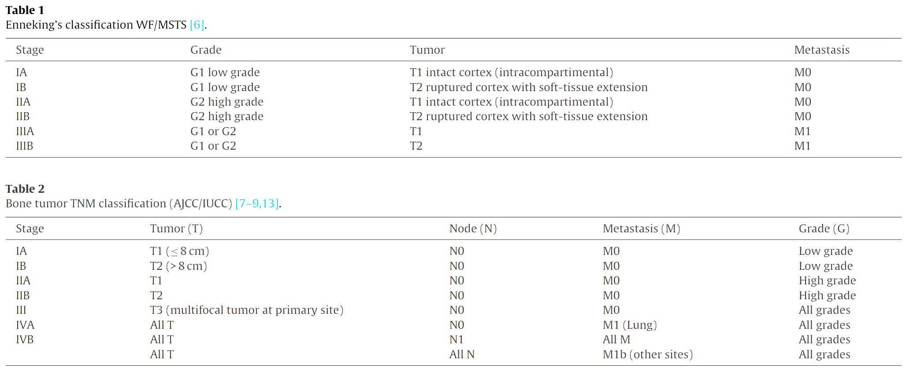

### 1. Epidemiology

1. rare
2. common in children and young adults
3. common sites: knee and shoulder
4. 5-year survival rate
   * 60%: localized
   * 20%: metastatic (10~15%, primarily in lung) or recurrent
5. (Paget's disease)

### 2. Staging and Prognosis

1. diagnosed by biopsy

   

   

2. MSTS and AJCC-UICC staging systems

   

3. prognosis

   * pretreatment: metastases and axial skeletal location
   * post-treatment: incomplete resection and poor response to chemotherapy

### 3. Treatment

